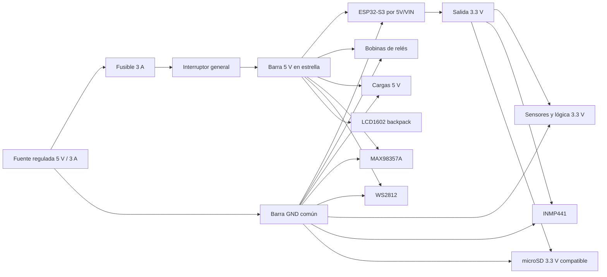
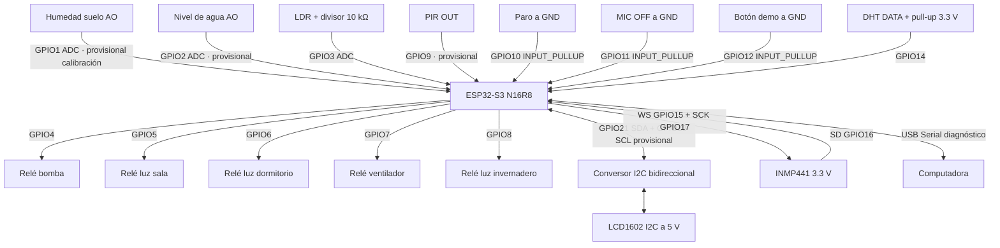
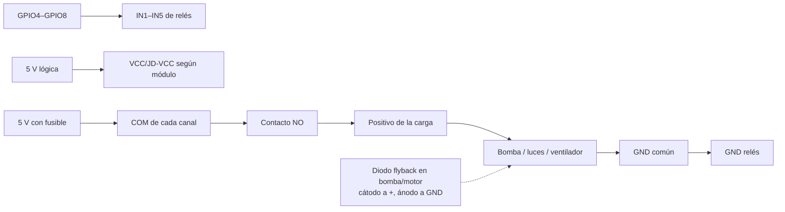
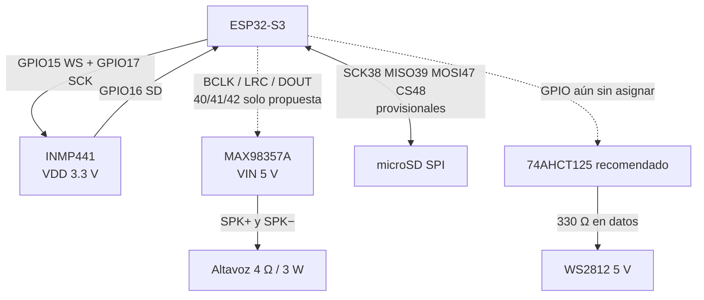
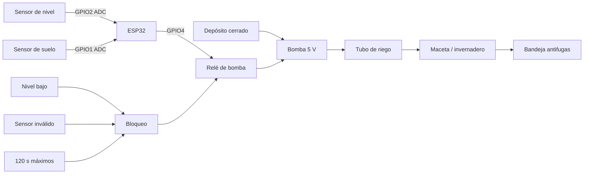

# Diagramas generales de conexiones

> [!DANGER]
> Usar estos diagramas solo después de aprobar
> [[16 - Plan de testeo antes de construccion]]. Los GPIO marcados como
> provisionales deben confirmarse en la serigrafía. Todo el montaje es baja
> tensión DC; no conectar red eléctrica dentro de la maqueta.

## 1. Distribución de energía

La bomba, ventilador, relés, audio y WS2812 no se alimentan desde 3.3 V. Usar
ramales separados desde la barra y capacitores cerca de las cargas ruidosas.

## 2. Mapa general de señales del ESP32

Si el backpack LCD ya trabaja a 3.3 V y sus pull-ups están a 3.3 V, el
conversor puede no ser necesario; verificarlo eléctricamente, no asumirlo.

## 3. Relés y cargas

Confirmar si el módulo es activo en LOW y si separa JD-VCC/VCC. No puentear ni
aislar tierras sin seguir el esquema específico del módulo comprado.

## 4. Audio, Jarvis, microSD y aro

Todos comparten referencia GND cuando el módulo lo exige. Añadir capacitor de
reserva cerca del aro. El altavoz se conecta únicamente entre SPK+ y SPK−.

## 5. Agua y seguridad física

El depósito y los tubos quedan al lado opuesto del gabinete. Usar bucles
antigoteo y situar la electrónica al menos 25 cm por encima del agua.

## Tabla final de conexiones

| Grupo | Señal | GPIO | Estado |
|---|---|---:|---|
| ADC | Humedad suelo | 1 | Calibrar físicamente. |
| ADC | Nivel de agua | 2 | Provisional. |
| ADC | LDR | 3 | Divisor a 3.3 V. |
| Relés | Bomba/sala/dormitorio/ventilador/invernadero | 4/5/6/7/8 | Confirmar activo LOW. |
| Entrada | PIR | 9 | Provisional. |
| Entrada | Paro/MIC OFF/demo | 10/11/12 | A GND, `INPUT_PULLUP`. |
| I2C | SCL/SDA LCD | 13/21 | SCL provisional; revisar niveles. |
| Sensor | DHT | 14 | Pull-up a 3.3 V. |
| I2S RX | INMP441 WS/SD/SCK | 15/16/17 | Provisional. |
| UART opcional | DFPlayer RX/TX | 18/19 | Deshabilitado; revisar USB nativo. |
| SPI opcional | SD SCK/MISO/MOSI/CS | 38/39/47/48 | Provisional. |
| I2S TX | MAX98357A BCLK/LRC/DOUT | 40/41/42 propuestos | No definitivo. |
| LED | WS2812 DATA | Sin asignar | Elegir después del pinout. |

## Relaciones

- [[05 - Auditoria de pines y cableado]]
- [[14 - Protocolo anti-colapso IA y ESP32]]
- [[16 - Plan de testeo antes de construccion]]
- [[18 - Manual maestro de conexiones pin por pin]]
- [[19 - Plan de testeo despues de construccion]]
