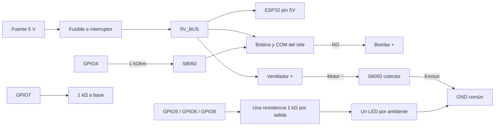

# Simplificación y reducción de costos

> [!IMPORTANT]
> Esta es la ruta económica vigente, corregida al inventario real. Solo existe
> un relé desnudo, pero queda reservado. La bomba se maneja con S8050. GPIO5-8
> no tienen etapa física y permanecen bloqueados.

## Decisión aplicada

El programa conserva los cinco controles lógicos, pero el firmware de banco
solo permite una etapa física: `GPIO4`. Esta también arranca bloqueada mediante
`HABILITAR_BOMBA=false`; GPIO5-8 no se habilitan al cambiar esa línea.

La variante económica es para la maqueta con un LED individual por ambiente.
Si se necesitan tiras o varias luces por salida, conservar los relés o diseñar
un driver dimensionado para esa carga; el GPIO no las alimenta directamente.

## Qué se puede dejar fuera

| Elemento | Decisión | Consecuencia |
|---|---|---|
| Relé adicional de cuatro canales | Evitable con el perfil 1 y cargas verificadas | Conserva los cinco controles lógicos; cambia la etapa eléctrica |
| INMP441, MAX98357A, altavoz, WS2812 | Posponer | Jarvis y audio siguen pendientes; el núcleo no depende de ellos |
| Lector microSD y tarjeta | Posponer | No hay registro persistente en tarjeta; diagnóstico por USB y memoria circular siguen disponibles |
| Panel, batería, cargador y elevador | Retirar del circuito | Panel y batería sólo estéticos; funciona con fuente regulada |
| Set completo de jumpers | Evitable si ya hay conectores/cable y herramientas | Usar uniones aisladas y firmes, nunca cables retorcidos sueltos |
| Sensor de nivel y paro físico | Conservar | Son protecciones del riego y del sistema |
| Fuente, fusible y desacoplo | Conservar | No recortar la alimentación para ahorrar |

Las banderas de voz, MP3 y microSD continúan apagadas. No se eliminan los
archivos de desarrollo opcionales ni se presenta la voz pendiente como terminada.

## Cableado exacto del perfil económico

Alimentación y sensores: usar [[18 - Manual maestro de conexiones pin por pin]].
La siguiente tabla **reemplaza únicamente las cinco etapas de salida**.

| Salida | Conexión |
|---|---|
| Bomba GPIO4 | GPIO4 → 1 kΩ → base S8050; emisor → GND; colector → una pata de bobina; otra pata de bobina → 5V_BUS. 1N4007 sobre bobina: raya a +5 V y ánodo a colector. COM → 5V_BUS, NO → bomba +, bomba − → GND. NC aislado. |
| Sala GPIO5 | GPIO5 → resistencia 1 kΩ → ánodo LED; cátodo → GND |
| Cuarto GPIO6 | GPIO6 → resistencia 1 kΩ → ánodo LED; cátodo → GND |
| Invernadero GPIO8 | GPIO8 → resistencia 1 kΩ → ánodo LED; cátodo → GND |
| Ventilador GPIO7 | GPIO7 → resistencia 1 kΩ → base S8050; resistencia 10 kΩ base a emisor; emisor → GND; colector → ventilador −; ventilador + → 5V_BUS |
| Diodo ventilador | 1N4007 cátodo/banda → ventilador +; ánodo → ventilador − |

Comprobar el orden **E/B/C en la hoja de datos del transistor exacto**: S8050
de distintos fabricantes/encapsulados puede tener otro orden. El resistor
de base de 1 kΩ entrega aproximadamente 2.6 mA; no prueba que cualquier motor
quede correctamente conmutado. Medir corriente de arranque, VCE y temperatura.
Si no satura con margen, mantener el relé del ventilador o usar un MOSFET
especificado para VGS=3.3 V; no forzar el S8050 ni reducir la resistencia sin cálculo.
El ahorro del relé completo queda condicionado a superar esta prueba.

El diagrama resume energía; la tabla anterior incluye diodos, pull-down y
polaridades. No conectar motores a GPIO. Durante reset, comprobar las salidas
apagadas físicamente; el precargado de GPIO solo actúa una vez iniciado setup.

## Presupuesto orientativo

Con precios del proyecto del 1 de septiembre, conservando fuente a L350:
fuente 350 + portafusible 15 + fusibles 45 + capacitores 35 + PCT 40 = **L485**.
Con cable desde L35: **L520**, más envío y cualquier material no disponible.
Esto supone que relé individual, LED, resistencias, transistor y diodos ya
están disponibles y resultan aptos. Confirmar inventario antes de comprar.

Comparación equivalente con cable y sin jumpers: L770 → L520, ahorro potencial
**L250** por el relé de cuatro canales. El set completo puede añadir hasta L250.
Posponer voz/SD evita por ahora L528 más INMP441. Retirar solar funcional evita
la estimación histórica de L1,355; no se promete autonomía.

La página de [fuentes C&D](https://sps.cdtechnologia.net/2985-fuente-para-raspberry-pi3-pi4.html)
mostró precio base L248 durante la consulta, pero incluye variantes: verificar
precio de la USB-C con interruptor antes de sustituir los L350 presupuestados.

## Pruebas de aceptación antes de usar cargas

1. Compilar el perfil original y el económico; seleccionar el que corresponda al mazo.
2. Sin motores, comprobar niveles OFF/ON de los cinco GPIO y cinco ciclos de arranque.
3. Medir consumos de cada rama y caída de tensión en el bus.
4. Verificar el transistor del ventilador con carga y durante arranque.
5. Desconectar/cortocircuitar a GND la señal del nivel: bomba bloqueada.
6. Calibrar los tres ADC: los límites nuevos rechazan los rieles, pero una
   entrada flotante puede quedar dentro del rango. No garantizan detectar todo cable abierto.
7. Probar PARO físico, timeout de riego, recuperación y funcionamiento simultáneo.

Continuar con [[19 - Plan de testeo despues de construccion]]. Ninguna prueba
de compilación o simulación certifica estos resultados eléctricos.
