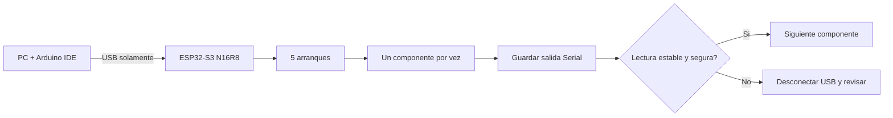
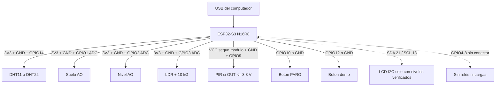
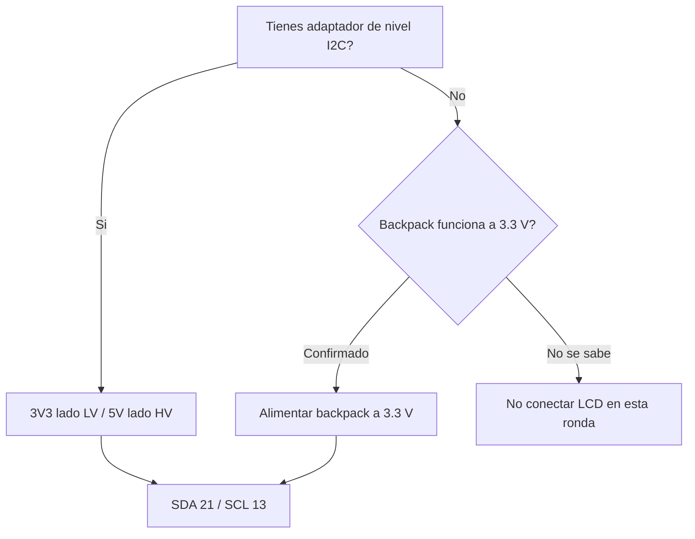

# Ronda de pruebas sin compras

Esta es la guia operativa para la primera ronda. Se usa
`firmware/domus_esqueleto` con `HABILITAR_RELE_BOMBA=false`. El inventario real
tiene un rele desnudo de 5 V; GPIO5-8 no tienen rele.

Versión para imprimir: [Paquete B01-B05 sin compras](../../output/pdf/DOMUS_Ronda_B01-B05_sin_compras.pdf).

> [!DANGER]
> En esta ronda no conectar bomba, motor, contactos de rele, bateria, panel
> solar ni ningun GPIO a 5 V. La placa se alimenta solo por su USB. Añadir un
> componente con el USB desconectado y volver a energizar despues de revisar.

## Que se puede cerrar mañana

| ID | Prueba | Se necesita | Resultado que se anota |
|---|---|---|---|
| B01 | Identificar placa | ESP32-S3 + cable USB | N16R8, conector y GPIO visibles |
| B02 | Cinco arranques | Solo ESP32-S3 | cinco inicios, sin reset continuo |
| B03a | DHT | DHT11/22 real | modelo, 20 lecturas y errores |
| B03b | LCD, condicional | LCD + I2C con nivel seguro | 0x27/0x3F o `LCD_NO_DETECTADO` |
| B04a | Suelo | modulo de suelo | crudo seco/humedo, `VS=1` |
| B04b | Nivel | sensor de nivel | crudo seco/mojado, `VN=1` |
| B04c | Luz | LDR + 10 kΩ | oscuro/claro, `VL=1` |
| B04d | PIR | PIR compatible 3.3 V | reposo/movimiento |
| B05 | Calibracion | suelo, nivel y LDR aprobados | valores guardados sobreviven reinicio |

B06-B10 quedan **diferidas**, no fallidas: necesitan relés, cargas o una prueba
de duración. La compra no bloquea el aprendizaje de B01-B05.

## Diagrama 1: secuencia de trabajo



## Diagrama 2: conexiones permitidas sin actuadores



## Diagrama 3: regla del LCD



Un LCD omitido se registra como `NO PROBADO`, no como fallo del firmware. No
alimentar el backpack a 5 V si sus resistencias pull-up llevan SDA/SCL a 5 V.

### LCD1602 con backpack I2C explicado

El backpack ya convierte los 16 pines paralelos del LCD en cuatro terminales:

| ESP32-S3 | Backpack | Función |
|---|---|---|
| GND | GND | referencia común |
| 3V3, solo si funciona a 3.3 V | VCC | alimentación segura inicial |
| GPIO21 | SDA | datos I2C |
| GPIO13 | SCL | reloj I2C |

Si el backpack necesita 5 V, colocar un adaptador bidireccional entre SDA/SCL:
lado `LV` a 3.3 V y ESP32; lado `HV` a 5 V y backpack. Muchos backpacks llevan
pull-ups a VCC, por lo que alimentarlo a 5 V puede llevar SDA y SCL a 5 V. El
potenciómetro azul ajusta contraste; una pantalla iluminada sin letras puede ser
solo contraste incorrecto. El firmware prueba direcciones `0x27` y `0x3F`.

## Preparacion del IDE

- Placa: `ESP32S3 Dev Module`.
- Flash Size: `16MB`.
- PSRAM: `OPI PSRAM`.
- Partition Scheme: `3M APP/9M FATFS`.
- CPU: `240 MHz`.
- Monitor serie: `115200`, fin de linea `Nueva linea` o `Ambos NL y CR`.
- Mantener `HABILITAR_RELE_BOMBA=false`.

Al arrancar debe aparecer una linea similar a:

```text
DOMUS_LISTO;PLACA=ESP32-S3-N16R8;PERFIL=BANCO_SIN_ACTUADORES;SALIDAS=0;USE_DIAGNOSTICO
```

Enviar `DIAGNOSTICO`. En `SENSORES`, `VS`, `VN`, `VL` y `VA` indican validez
basica; `CAL=0` es normal antes de calibrar.

## Cableado, un componente por vez

| Componente | VCC | GND | Señal | Precaucion |
|---|---|---|---|---|
| DHT | 3V3 | GND | DATA a GPIO14 | confirmar si es DHT11 o DHT22 |
| Suelo | 3V3 | GND | AO a GPIO1 | no usar DO; retirar del agua/tierra al terminar |
| Nivel | 3V3 | GND | AO a GPIO2 | mojar solo zona sensible |
| LDR | 3V3 | GND | punto medio a GPIO3 | divisor con 10 kΩ |
| PIR | según módulo | GND | OUT a GPIO9 | medir que OUT no supere 3.3 V |
| PARO | - | GND | GPIO10 | pulsador normalmente abierto |
| Boton demo | - | GND | GPIO12 | pulsador normalmente abierto |

GPIO2, GPIO9 y GPIO13 siguen sujetos a verificar que existan y estén rotulados
en la placa concreta. Si no aparecen, parar y fotografiar ambas caras; no mover
el cable a otro GPIO sin actualizar firmware y mapa.

## Hoja de registro

| Fecha/hora | ID | Componente/estado | Min | Max | Validez | PASS/FAIL/NO PROBADO | Observacion/foto |
|---|---|---|---:|---:|---|---|---|
| | B01 | Placa N16R8 | | | | | |
| | B02 | Arranque 1-5 | | | | | |
| | B03a | DHT | | | VA= | | |
| | B03b | LCD | | | addr= | | |
| | B04a | Suelo seco/humedo | | | VS= | | |
| | B04b | Nivel seco/mojado | | | VN= | | |
| | B04c | LDR oscuro/claro | | | VL= | | |
| | B04d | PIR reposo/movimiento | | | | | |
| | B05 | Calibracion tras reinicio | | | CAL= | | |

## Calibracion solo despues de observar rangos

Con salidas desconectadas, enviar `PARO`. Sustituir `...` por mediciones reales:

```text
CAL SECO=...
CAL HUMEDO=...
CAL OSCURO=...
CAL CLARO=...
CAL NIVEL=...
CAL VER
CAL GUARDAR
REARMAR
```

No copiar los ejemplos de otras notas. Suelo seco/humedo y luz oscura/clara
deben separarse al menos 100 cuentas. `CAL NIVEL` es la lectura minima que aun
representa agua suficiente; se confirma observando si el valor sube o baja al
mojar el sensor.

## Criterios para detenerse

- Olor, calor anormal, reinicios repetidos o USB que se desconecta.
- Cualquier señal medida por encima de 3.3 V.
- GPIO no identificado o componente con pines ambiguos.
- ADC clavado cerca de 0 o 4095: anotar `V*=0` y revisar cableado.
- DHT con `VA=0` durante más de 20 intentos: revisar modelo y conexión.

## Al finalizar

Guardar el texto del monitor serie, fotos del cableado y esta tabla completada.
Actualizar B01-B05 en [[33 - Base modular funcional y plan de banco]]. No poner
`HABILITAR_RELE_BOMBA=true`; eso pertenece a B06 despues de montar y medir
S8050, resistencia, diodo y rele sin conectar todavia la bomba.

## Relaciones

- [[01 - Inventario confirmado]]
- [[33 - Base modular funcional y plan de banco]]
- [[35 - Preparacion Arduino IDE y revision documental]]
- [[36 - Configuracion final 1 mas 4 reles y planos v4]]
