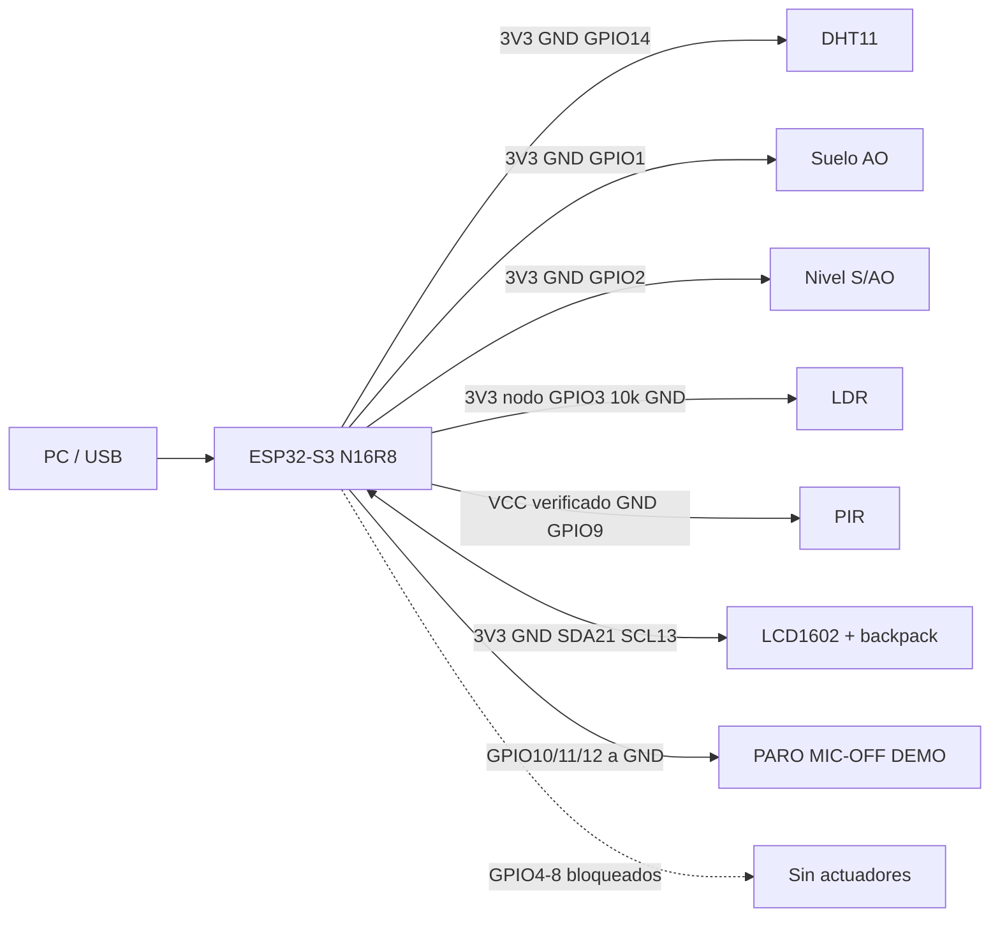
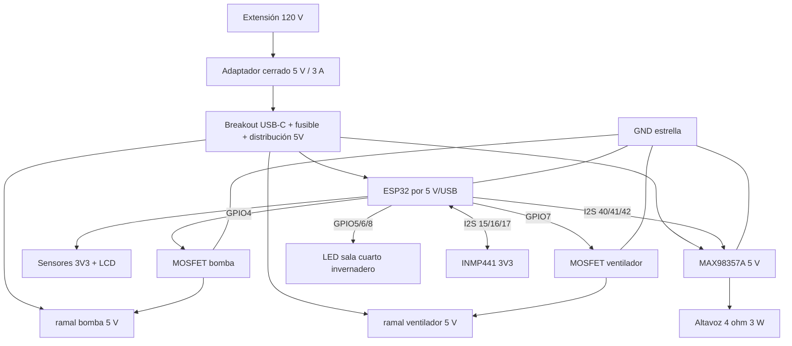

# Presupuesto mínimo, Jarvis y migración del firmware

> [!IMPORTANT]
> Actualización final: se cotiza fuente cerrada 5 V/5 A y DRV8833. La luz de
> invernadero usa dos LED azules y uno rojo existentes; no se compra UV. Véase
> [[43 - Manual final completo PROJECT DOMUS]].

> [!IMPORTANT]
> La cotización vigente está en [[41 - Compra nacional minima y banco de soldadura]]:
> un DRV8833 de dos canales reemplaza los dos MOSFETs separados.

Esta nota responde la decisión técnica posterior a la prueba de la bomba: el
MB102 está averiado; el TP4056 sirvió temporalmente como entrada USB-C, pero no
forma parte de la fuente final. La casa usará corriente de pared mediante un
adaptador cerrado de 5 V. Las cargas son DC de baja tensión y, por ahora, no hay
una necesidad demostrada de comprar cuatro relés.

> [!IMPORTANT]
> Decisión propuesta, pendiente de medir corriente: bomba y ventilador por
> MOSFET de nivel lógico; luces LED por GPIO/resistencia o transistor según
> cantidad. El relé existente queda opcional. No comprar cuatro relés todavía.

## Cuánto falta gastar

### A. Casa funcional y alimentación profesional

| Compra | Precio usado | Estado de la cifra |
|---|---:|---|
| Fuente cerrada 5 V/3 A | L248 | precio base publicado; confirmar variante USB-C/switch |
| Breakout/entrada USB-C a distribución | L80 | precio publicado de puerto USB-C para PCB; comprobar que entregue VBUS/GND |
| Portafusible | L15 | referencia local |
| Tres fusibles | L45 | referencia local; valor final después de medir/cablear |
| Capacitores 1000 µF, paquete | L35 | referencia local |
| Conectores PCT | L40 | referencia local |
| Cable 22 AWG | L35+ | mínimo histórico |
| Dos drivers MOSFET lógicos | sin precio local confirmado | comprar solo tras medir bomba/motor |

Subtotal conocido: **L498 + MOSFETs + envío**. Si ya consiguen gratuitamente
una fuente 5 V adecuada o cable/conectores, se descuenta esa fila; no se descuenta
una pieza desconocida o no medida.

### B. Jarvis local que escucha y habla

Ruta mínima elegida: INMP441 + PicoTTS + MAX98357A + altavoz. No requiere
microSD para arrancar y no compra DFPlayer/MAX98357A simultáneamente.

| Compra | Precio | Necesidad |
|---|---:|---|
| INMP441 | estimación L100-L250 | obligatorio para escuchar; sin oferta hondureña verificada |
| MAX98357A | L130 | obligatorio para PicoTTS hablado |
| Altavoz 4 Ω/3 W | L90 | obligatorio |
| microSD + lector SPI | L308 | opcional; no incluir en mínimo |
| 74AHCT125/HCT14 | sin precio local | solo si se usa WS2812 a 5 V y la señal lo requiere |

Jarvis mínimo adicional: **L320-L470 + envío**.

### Total orientativo

| Alcance | Total pendiente conocido |
|---|---:|
| Casa sin Jarvis | L498 + 2 MOSFETs + envío |
| Casa + Jarvis hablado | **L818-L968 + 2 MOSFETs + envío** |
| Con microSD opcional | L1,126-L1,276 + MOSFETs + envío |

La cifra no incluye materiales de maqueta ni herramientas. Tampoco incluye
cuatro relés, batería, panel solar, TP4056, elevador o DFPlayer adicional.

## Diagrama del test actual: `domus_esqueleto`



Reglas: LCD es una sola pieza de cuatro cables. `FIS=00000`. Los ADC se prueban
primero individualmente y luego simultáneos. Las lecturas de entradas flotantes
no son resultados de sensor.

## Diagrama después de comprar lo mínimo



El adaptador de pared permanece cerrado; 120 V nunca entra a protoboard o
maqueta. La fuente se divide antes de las cargas: la corriente de motores no
atraviesa el regulador de 3.3 V ni las pistas del ESP32. Cada motor conserva
diodo flyback y capacitor local. Los pines I2S 40/41/42 se confirman físicamente
antes de comprar o soldar.

## Diferencias entre firmware de test y firmware final

| Tema | `domus_esqueleto` actual | Final requerido |
|---|---|---|
| Propósito | banco y diagnóstico | demostración completa |
| Salidas | GPIO4-8 físicamente bloqueados | bomba, ventilador y tres luces habilitadas por perfil |
| Bomba | timeout 10 s | límite final definido tras caudal/depósito; nunca sin nivel |
| Calibración | NVS, valores medidos | conservar exactamente este mecanismo |
| LCD/sensores | integrados y prioritarios | conservar; una falla no bloquea seguridad |
| Voz | ausente | INMP441 + clasificador int8 + PicoTTS/MAX98357A |
| Almacenamiento | solo NVS | microSD opcional, nunca requisito de arranque |
| Estructura | sketch compacto de banco | módulos separados y una sola fuente de verdad |
| Seguridad | PARO, watchdog, nivel, bloqueo | conservar y probar también durante audio/cargas |

## Cambios de código que se deben hacer

### 1. Dejar de mantener dos controladores divergentes

El esqueleto probado se convierte en el núcleo. Del firmware grande se migran
funciones por módulo; no se copian correcciones en ambos sketches indefinidamente.

### 2. Crear perfiles físicos explícitos

```text
BANCO_SENSORES     GPIO4-8 INPUT, FIS=00000
BANCO_BOMBA        GPIO4 MOSFET; GPIO5-8 bloqueados, FIS=10000
FINAL_SIN_RELES    GPIO4 bomba, GPIO5/6/8 LED, GPIO7 ventilador
FINAL_JARVIS       FINAL_SIN_RELES + I2S micrófono/audio
```

Cada perfil define pin, polaridad y capacidad de salida. `DIAGNOSTICO` imprime
el perfil; una combinación imposible falla en compilación. No autodetectar
relé/transistor mediante pulsos.

### 3. Sustituir terminología y polaridad de relés

- Renombrar `PINES_RELES` a `PINES_SALIDAS`.
- Reemplazar `DOMUS_SALIDAS_ECONOMICAS` por el perfil anterior.
- Bomba y ventilador con MOSFET: activos en `HIGH`.
- LEDs GPIO5/6/8: activos en `HIGH`, con resistencia individual.
- Precargar cada pin a su estado OFF antes de `OUTPUT`.

### 4. Promover lo bueno del esqueleto

- Calibración NVS versionada con checksum.
- Parser acotado y `PARO` prioritario.
- Propiedad AUTO/manual.
- LCD 0x27/0x3F con timeout.
- Watchdog, heap, bloqueo y rearme explícito.
- Diagnóstico `FIS/OUT/VA/VS/VN/VL/CAL`.

### 5. Integrar Jarvis sin tocar directamente GPIO

El clasificador produce una orden y llama al mismo despachador manual/automático.
La captura y TTS van en tareas acotadas; PARO mantiene prioridad. Mientras habla,
el micrófono se pausa para que Jarvis no se escuche a sí mismo. Si micrófono,
modelo o amplificador fallan, la casa sigue funcionando sin voz.

### 6. Pruebas antes de reemplazar el binario de banco

1. Compilar los cuatro perfiles.
2. Cinco reinicios sin pulsos.
3. Medir corriente de bomba y ventilador; aprobar MOSFET y temperatura.
4. Probar PARO y nivel durante cada carga y todas simultáneas.
5. Comparar reconocimiento host/ESP32 y probar ruido/altavoz.
6. Ejecutar 1,000 ciclos o 24 h sin reset ni crecimiento sostenido.
7. Conservar un binario `BANCO_SENSORES` conocido para recuperación.

## Orden de compra recomendado

1. Fuente 5 V adecuada y breakout/distribución.
2. Medir bomba y ventilador.
3. Comprar dos MOSFETs lógicos dimensionados a esas mediciones.
4. Probar la casa completa sin voz.
5. Comprar INMP441, MAX98357A y altavoz.
6. MicroSD solo si aparece un requisito real de archivos/registros.

## Relaciones

- [[03 - Lista de compras definitiva]]
- [[25 - Plan ejecutable Jarvis offline fiable y entrenado]]
- [[38 - Reunion integracion final y rumbo del firmware]]
- [[39 - Inventario fotografiado y pines visibles]]
