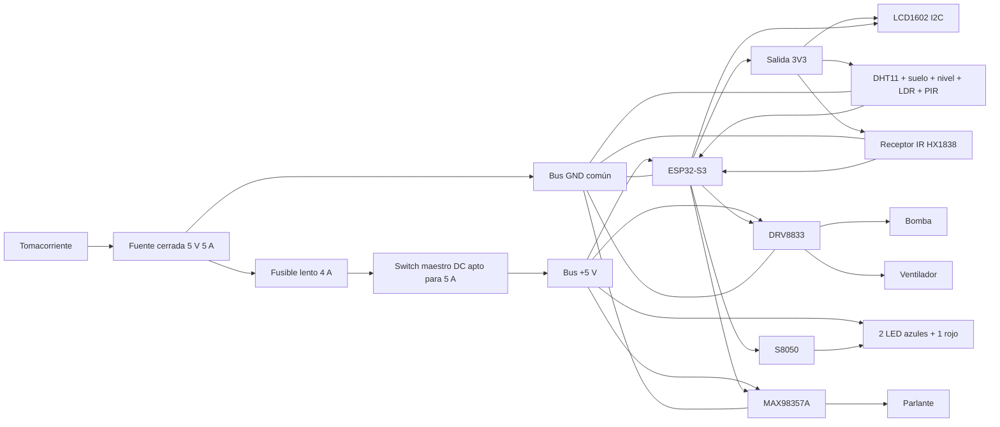

# Manual final completo PROJECT DOMUS

Este documento reúne la arquitectura vigente, las conexiones, las compras, el
orden de montaje, las pruebas, los cambios de firmware y el guion técnico de la
feria. Si una nota anterior lo contradice, manda este manual.

## 1. Qué demuestra el proyecto

DOMUS es una maqueta de casa inteligente local controlada por un ESP32-S3. Mide
temperatura y humedad ambiental, humedad del suelo, nivel de agua, iluminación
y presencia. Con esas lecturas puede mostrar información en el LCD, regar una
planta, ventilar, controlar luces de habitaciones y encender iluminación
suplementaria de cultivo.

La iluminación del invernadero **no es ultravioleta**. Dos LED azules y uno rojo
representan una lámpara de cultivo. Cuando la iluminación natural resulta baja,
el LDR lo detecta y el ESP32 los enciende durante el horario permitido. No se
afirma que tres LED hagan crecer una planta real ni que la planta deba permanecer
iluminada las 24 horas.

Jarvis recibe órdenes mediante el control infrarrojo CAR MP3 y responde en
español por MAX98357A y parlante. No usa reconocimiento de voz ni requiere
entrenar una IA. El núcleo funciona aunque el audio se silencie o falle.

## 2. Decisiones finales

| Tema | Decisión vigente |
|---|---|
| Controlador | ESP32-S3 N16R8 ya disponible |
| Alimentación | Fuente cerrada regulada 5 V/5 A, sin batería ni solar funcional |
| Bomba y ventilador | Un DRV8833, un canal para cada motor |
| Relés | No comprar; el relé desnudo queda como repuesto/demostración separada |
| Invernadero | LDR + 2 LED azules + 1 rojo + S8050 |
| Pantalla | LCD1602 con backpack I2C comprobado a 3.3 V, cuatro conexiones |
| Jarvis | Control CAR MP3 + receptor HX1838 en GPIO12 |
| Audio | MAX98357A + parlante 4 ohm/3 W; frases desde flash |
| TP4056 | Solo banco temporal; no forma parte de la casa final |
| Condensadores | Reducen picos y ruido; no corrigen una fuente insuficiente |
| microSD/DFPlayer | Opcionales, fuera del núcleo final |
| Tensión de red | Nunca entra en la maqueta; solo se usa el adaptador cerrado |

## 3. Arquitectura general



Todos los módulos de baja tensión comparten GND. Los ramales de bomba,
ventilador y audio deben regresar directamente al distribuidor, no atravesar la
zona de sensores de la protoboard.

## 4. Mapa de GPIO definitivo

| GPIO | Conexión | Estado inicial |
|---:|---|---|
| 1 | AO del sensor de humedad de suelo | entrada ADC |
| 2 | señal analógica del sensor de nivel | entrada ADC |
| 3 | punto medio del divisor LDR/10 kOhm | entrada ADC |
| 4 | AIN1 del DRV8833, bomba | salida apagada |
| 5 | luz de sala mediante resistencia/etapa adecuada | salida apagada |
| 6 | luz de dormitorio mediante resistencia/etapa adecuada | salida apagada |
| 7 | BIN1 del DRV8833, ventilador | salida apagada |
| 8 | 1 kOhm hacia base del S8050 de luces de cultivo | salida apagada |
| 9 | OUT del PIR | entrada |
| 10 | paro físico a GND | INPUT_PULLUP |
| 11 | switch SILENCIO JARVIS a GND | INPUT_PULLUP |
| 12 | señal S/OUT del receptor HX1838 | entrada digital IR |
| 13 | SCL del LCD | I2C |
| 14 | DATA del DHT11 | entrada con pull-up 10 kOhm |
| 15 | buzzer activo mediante segundo S8050 | salida activa HIGH |
| 16 | BCLK del MAX98357A | I2S reloj |
| 17 | LRC del MAX98357A | I2S reloj |
| 18 | DIN del MAX98357A | I2S salida |
| 21 | SDA del LCD | I2C |

Los GPIO 19 y 20 se reservan para USB nativo. Antes de soldar se comprobará que
todos los GPIO anteriores estén realmente expuestos en la placa N16R8.

## 5. Alimentación y distribución

```text
Fuente +5 V -> portafusible -> fusible lento 4 A -> switch maestro -> BUS +5 V
Fuente GND --------------------------------------------------------> BUS GND

BUS +5 V -> ESP32/VIN, DRV8833, MAX98357A y ánodos de LED
ESP32 3V3 -> LCD, DHT11, sensores analógicos y receptor HX1838
BUS GND  -> GND de todos los módulos y emisores/retornos
```

Antes de conectar electrónica, medir el jack: centro positivo y aproximadamente
5.0 V. El adaptador jack a tornillos debe respetar polaridad. El ESP32 se alimenta
por **una sola ruta**: su USB-C o su pin 5V/VIN confirmado, nunca ambas durante la
prueba de alimentación externa. Si se programa por USB mientras la casa usa la
fuente, mantener solo GND común y evitar unir dos salidas de 5 V.

Colocar un condensador de 1000 uF/25 V entre VM y GND cerca del DRV8833 y otro
entre VIN y GND cerca del MAX98357A. En electrolíticos, la franja marca negativo.
Añadir 100 nF cerca de cada módulo si el montaje lo permite. Ningún condensador
sustituye el fusible, el cableado correcto o una fuente estable.

## 6. Conexiones pin por pin

### 6.1 LCD1602 con I2C

El LCD completo solo expone cuatro pines:

| LCD I2C | Conectar a |
|---|---|
| GND | GND común |
| VCC | 3V3; funcionamiento confirmado por Isaac |
| SDA | GPIO21 |
| SCL | GPIO13 |

No se compra conversor de nivel: esta unidad funciona a 3.3 V. El firmware busca
las direcciones 0x27 y 0x3F. Si deja de responder, revisar contraste, dirección,
SDA y SCL; no cambiar VCC a 5 V como primera solución.

### 6.2 DHT11 suelto de cuatro patas

Visto de frente, rejilla azul hacia nosotros y patas hacia abajo, el orden típico
es VCC, DATA, NC, GND. Confirmar el modelo antes de energizar.

```text
DHT VCC  -> 3V3
DHT DATA -> GPIO14
10 kOhm  -> entre DATA y 3V3
DHT NC   -> sin conexión
DHT GND  -> GND
```

### 6.3 Sensor de humedad del suelo

```text
Sonda de dos puntas -> conector del módulo comparador
Módulo VCC          -> 3V3
Módulo GND          -> GND
Módulo AO           -> GPIO1
Módulo DO           -> sin conexión
```

Se usa AO para calibrar; el potenciómetro solo modifica DO. La sonda resistiva
se corroe, por lo que no debe permanecer energizada durante meses.

### 6.4 Sensor de nivel de agua

```text
VCC/señal positiva -> 3V3
GND                -> GND
S/OUT              -> GPIO2
```

Confirmar la serigrafía exacta. Mantener la placa electrónica lejos del agua y
calibrar vacío, nivel mínimo y lleno antes de autorizar la bomba.

### 6.5 Fotoresistencia

```text
3V3 -> LDR -> punto de lectura -> resistencia 10 kOhm -> GND
                  |
                  +-> GPIO3
```

La orientación de la LDR no importa. El firmware guarda una lectura en oscuridad
y otra con luz; no debe usarse un número copiado de otra maqueta.

### 6.6 PIR

```text
PIR VCC -> 5 V si es HC-SR501 confirmado
PIR OUT -> GPIO9
PIR GND -> GND
```

Esperar su estabilización inicial y confirmar con multímetro que OUT no supera
3.3 V. El PIR no mide distancia: solo cambios de radiación infrarroja asociados
al movimiento.

### 6.7 DRV8833, bomba y ventilador

```text
Fuente +5 V -> VM del DRV8833
GND común   -> GND del DRV8833
3V3         -> nSLEEP/SLEEP (si está expuesto; HIGH habilita)

GPIO4 -> AIN1              AOUT1 -- bomba -- AOUT2
GND   -> AIN2

GPIO7 -> BIN1              BOUT1 -- motor/ventilador -- BOUT2
GND   -> BIN2
```

Esta conexión permite una dirección: GPIO HIGH mueve el motor y LOW lo deja
apagado. Si gira al revés, intercambiar los dos cables del motor. No conectar la
bomba entre VM y una salida. No añadir diodos externos sobre AOUT/BOUT salvo que
la ficha de la placa concreta lo exija: el puente H ya gestiona la carga
inductiva. Confirmar corriente continua real del módulo y medir el arranque de
cada motor antes de probar ambos juntos.

### 6.8 Tres LED de iluminación suplementaria

```text
+5 V -> 330 ohm -> ánodo LED azul 1  cátodo --+
+5 V -> 330 ohm -> ánodo LED azul 2  cátodo --+-> colector S8050
+5 V -> 330 ohm -> ánodo LED rojo    cátodo --+

GPIO8 -> 1 kOhm -> base S8050
base  -> 10 kOhm -> GND
emisor S8050     -> GND común
```

Cada LED requiere su propia resistencia. La pata larga suele ser ánodo; la corta
y el borde plano suelen indicar cátodo, pero se confirma antes de soldar. El
orden físico E/B/C del S8050 cambia entre fabricantes: identificarlo por ficha
del lote o multímetro, no por una imagen genérica.

### 6.9 Control infrarrojo Jarvis

```text
HX1838 S/OUT -> GPIO12
HX1838 +/VCC -> 3V3
HX1838 -/GND -> GND
100 nF       -> entre VCC y GND, cerca del receptor
```

El orden físico se confirma por las marcas `S`, `+` y `-`; no por izquierda o
derecha. Primero se carga un lector IR y se registra el código real de cada
botón. Los códigos copiados de internet no son autoridad. `0` apaga cargas,
`5` solicita riego, `CH+` activa automático, `VOL+/-` cambia volumen y `200+`
rearma. Las tramas de repetición se ignoran para riego y rearme.

### 6.10 Audio de respuesta

```text
MAX98357A:  VIN->5V, GND->GND, BCLK->GPIO16, LRC->GPIO17,
            DIN->GPIO18, SPK+ y SPK- -> parlante
```

El parlante se conecta solamente entre SPK+ y SPK-; ninguno va a GND. Las frases
españolas fijas se almacenan en flash y se reproducen después de cada orden IR.
No hay micrófono ni dúplex.

### 6.11 Botones y buzzers

```text
GPIO10 ---- botón de paro ---- GND
GPIO11 ---- SILENCIO JARVIS -- GND
GPIO15 ---- 1 kOhm -> base S8050 -> buzzer activo 5 V
```

GPIO10/11 usan INPUT_PULLUP: suelto=HIGH y accionado=LOW. El segundo S8050
conmuta el buzzer activo; añadir 10 kOhm base-GND. El buzzer pasivo es alternativa
de banco en GPIO15 para tonos, no se conecta simultáneamente con el activo. Los
switches no transportan corriente de motores.

## 7. Lista final de compras

### Comprar o cotizar ahora

1. Un módulo DRV8833 doble compatible con lógica de 3.3 V y SLEEP accesible.
2. Una fuente cerrada regulada de 5 V/5 A, protección de corto/sobrecorriente,
   jack 5.5x2.1 mm centro positivo y adaptador hembra a tornillos.
3. Un MAX98357A de 3 W.
4. Un parlante de 4 ohm/3 W.
5. Una baquelita perforada de 100x220 mm.
6. Un paquete de cuatro borneras PCB de dos pines, paso 2.54 mm.
7. Un portafusible aéreo 5x20 mm.
8. Dos fusibles lentos de 4 A y 5x20 mm.
9. Un paquete de cinco electrolíticos de 1000 uF/25 V/105 C.

### Cotizar aparte

- 74AHCT125 DIP o 74HCT125 DIP para una posible tira WS2812 a 5 V. No comprar
  74HC125 como sustituto automático.

### No comprar

Relés adicionales, INMP441, conversor de nivel I2C, sensor UV, lámpara UV, MOSFETs separados para los dos motores,
microSD, DFPlayer, cable, estaño, headers, sensores repetidos, botones, LED,
resistencias, diodos, TP4056, batería, panel solar ni herramientas ya disponibles.

## 8. Diferencia entre firmware de prueba y firmware final

El archivo `firmware/domus_esqueleto/domus_config.h` todavía representa el banco
seguro anterior: `HABILITAR_BOMBA=false` y GPIO5-8 bloqueados. Esto es correcto
para conectar solamente sensores y LCD, pero **no controla aún el DRV8833 ni los
tres LED finales**.

Antes del montaje final deben hacerse estos cambios de software:

1. Sustituir `HABILITAR_BOMBA` por perfiles explícitos `BANCO_SENSORES` y
   `FINAL_DRV8833`.
2. En el perfil final habilitar GPIO4, 5, 6, 7 y 8 solo después de revisar cada
   etapa física.
3. Cambiar la descripción de GPIO4 de relé/S8050 a AIN1 del DRV8833.
4. Mantener GPIO7 como ventilador, ahora conectado a BIN1.
5. Cambiar GPIO8 a `ILUMINACION_CULTIVO` y conducir el S8050 activo en HIGH.
6. Mantener GPIO5 y GPIO6 para LED de sala y dormitorio.
7. Añadir decodificación HX1838 en GPIO12, aprendizaje de códigos y tabla del control.
8. Añadir audio de salida I2S: BCLK=16, LRC=17 y DIN=18.
9. Añadir horario de cultivo además de histéresis: la oscuridad por sí sola no
   debe mantener los LED encendidos toda la noche.
10. Conservar arranque apagado, paro físico, validación de nivel, timeout de bomba,
   rearme manual, watchdog y rechazo de sensores inválidos.

No basta con cambiar un `false` a `true`: primero debe existir el DRV8833 y
verificarse el cableado. El esqueleto actual se conserva como firmware de banco;
el perfil final se compila y prueba después de recibir los componentes.

## 9. Orden obligatorio de montaje y pruebas

1. Trabajar sin corriente y comprobar continuidad entre +5 V y GND; no debe
   existir cortocircuito.
2. Probar la fuente sola, medir polaridad y tensión.
3. Instalar portafusible, fusible y switch; volver a medir 5 V.
4. Probar ESP32 con el firmware de banco, sin actuadores.
5. Añadir LCD; ejecutar escáner I2C y confirmar 0x27 o 0x3F.
6. Añadir DHT, LDR, suelo, nivel y PIR uno por uno, registrando valores.
7. Calibrar oscuridad/luz, suelo seco/húmedo y nivel mínimo.
8. Probar DRV8833 sin motores y confirmar que no se calienta.
9. Probar bomba dentro de agua durante pulsos cortos; nunca en seco.
10. Probar ventilador separado y comprobar dirección.
11. Probar ambos motores juntos; observar reinicios, caída de 5 V y temperatura.
12. Montar los tres LED y verificar encendido automático sin parpadeo.
13. Registrar los 21 códigos IR; luego probar MAX98357A, volumen y frases.
14. Ejecutar una prueba completa de al menos una hora, vigilada.
15. Cortar inmediatamente ante olor, humo, cable caliente, reinicios repetidos,
    agua cerca de electrónica o tensión fuera de rango.

## 10. Criterios de aceptación

- Al energizar, bomba, ventilador y luces permanecen apagados.
- Desconectar un sensor no activa una carga peligrosa.
- Nivel bajo detiene y bloquea la bomba hasta rearmar.
- El timeout detiene la bomba aunque falle una orden.
- Cubrir el LDR durante el horario permitido enciende los LED de cultivo;
  descubrirlo los apaga sin parpadeos rápidos.
- El LCD presenta datos sin bloquear el control.
- Activar motores o audio no reinicia el ESP32 ni baja el bus de forma sostenida.
- El paro físico apaga todas las salidas.
- SILENCIO JARVIS impide reproducir audio sin bloquear las acciones IR.

## 11. Problemas probables y diagnóstico

| Síntoma | Revisar primero |
|---|---|
| Bomba no gira | Agua presente, VM=5 V, SLEEP alto, AIN1, cableado AOUT1/AOUT2 y corriente de arranque |
| ESP32 se reinicia | Caída de 5 V, GND deficiente, motor compartiendo cable fino, condensador o fuente |
| LCD apagado | VCC, contraste, dirección 0x27/0x3F y nivel lógico I2C |
| DHT sin datos | Orden de patas, pull-up 10 kOhm, tipo DHT11 y periodo mayor a 2 s |
| Lecturas ADC erráticas | Sensor a 5 V, GND largo, humedad, cable de motor cercano o falta de calibración |
| LED no enciende | Polaridad, resistencia individual, E/B/C real del S8050 y GPIO8 |
| Audio distorsionado | Parlante incorrecto, ganancia, alimentación, cables SPK o condensador cercano |
| PIR siempre activo | Tiempo de calentamiento, sensibilidad, jumper de repetición y movimiento ambiental |

## 12. Texto breve para la exposición

> PROJECT DOMUS usa un ESP32-S3 para integrar sensores, seguridad y automatización
> local. Cuando el suelo está seco y existe agua suficiente, puede activar el
> riego; cuando sube la temperatura, puede ventilar; y cuando falta iluminación
> natural durante el horario de cultivo, enciende LED rojos y azules que
> representan iluminación suplementaria. La maqueta no usa UV real. El sistema
> arranca con las cargas apagadas y conserva bloqueos de nivel, tiempo máximo de
> bomba, paro físico y control manual. Jarvis recibe órdenes por control
> infrarrojo y responde en español, sin nube ni entrenamiento de IA.

## 13. Documentos relacionados

- [[01 - Inventario confirmado]]: inventario físico.
- [[39 - Inventario fotografiado y pines visibles]]: límites de identificación.
- [[42 - Solicitud final de cotizacion C&D]]: mensaje listo para el proveedor.
- [[44 - Arquitectura y ciclo de vida del firmware]]: perfiles y orden de implementación.
- `visualizaciones/diagrama-cableado-interactivo/index.html`: diagrama navegable;
  ya actualizado a esta arquitectura. Aun asi, verificar el pinout impreso de cada
  modulo fisico antes de soldar porque los clones pueden cambiar el orden de pines.
