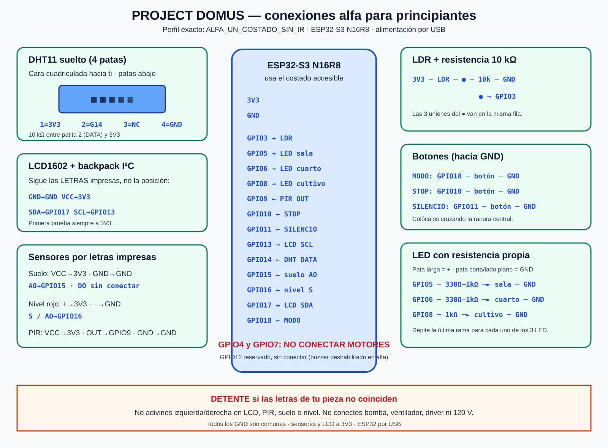

# Guía visual para conectar el banco alfa

> [!WARNING]
> HISTÓRICO: describe el alfa sin motores. El banco actual añade IR y permite
> una bomba con S8050. Usa `visualizaciones/domus-banco-final-s8050-ir.svg` y
> [[59 - Firmware unico y perfil banco S8050 IR]].

> [!DANGER]
> Esta guía es solamente para sensores, LCD, botones y LED. **No conectes todavía
> la bomba, el ventilador, el buzzer activo de 5 V, el controlador de motores ni
> corriente de 120 V.** El ESP32 se alimenta únicamente por su cable USB.
> GPIO12 reservado, sin conectar. Ver nota 50 (ola 1).



## Antes de poner un cable

1. Desconecta el USB del ESP32.
2. Busca las letras impresas en cada pieza. Si no coinciden con esta guía, detente.
3. Une todas las conexiones `GND` al mismo riel negativo de la protoboard.
4. Une `3V3` del ESP32 al riel positivo de sensores. En este banco el LCD también
   se prueba primero con **3V3**, no con 5 V.
5. Solo vuelve a conectar el USB cuando hayas revisado cada cable.

## DHT11 azul suelto — temperatura y humedad

Sostén el DHT11 con la **cara cuadriculada/perforada mirando hacia ti** y las
cuatro patas apuntando hacia abajo. Cuenta de izquierda a derecha:

```text
       CARA CUADRICULADA HACIA TI
        ┌───────────────────┐
        │  ▦ ▦ ▦ ▦ ▦ ▦ ▦   │
        └───────────────────┘
          1    2    3    4
          │    │         │
         3V3  G14       GND
               │
          resistencia 10 kΩ hacia 3V3
```

| Patita | Conexión | Explicación |
|---:|---|---|
| 1, la de más a la izquierda | `3V3` | Alimentación segura del sensor. |
| 2 | `GPIO14` | Cable de datos. Añade una resistencia de 10 kΩ entre esta patita y 3V3. |
| 3 | **sin conectar** | `NC` significa “no conectar”. |
| 4, la de más a la derecha | `GND` | Tierra común. |

> [!WARNING]
> Esta numeración es para el DHT11 **suelto de cuatro patas**. Un módulo de tres
> pines puede tener otro orden: en ese caso manda lo que diga `+`, `OUT/S` y `-`.

## LCD1602 con mochila I²C

Mira la pequeña placa soldada detrás del LCD. Usa las letras impresas junto al
conector; no cuentes pines por posición porque distintos fabricantes cambian el orden.

| Letra impresa en LCD | Conectar a ESP32 |
|---|---|
| `GND` | `GND` |
| `VCC` | `3V3` |
| `SDA` | `GPIO17` |
| `SCL` | `GPIO13` |

Si enciende la luz de fondo pero no aparecen letras, no cambies cables al azar:
el firmware debe informar por Serial la dirección I²C encontrada.

## Sensor de humedad de suelo

La horquilla de dos puntas se conecta únicamente al conector de dos pines del
módulo comparador. En el lado de cuatro pines del módulo busca las letras:

| Letra impresa | Conectar a ESP32 |
|---|---|
| `VCC` o `+` | `3V3` |
| `GND` o `-` | `GND` |
| `AO` | `GPIO15` |
| `DO` | **sin conectar** |

No dejes la sonda resistiva energizada permanentemente fuera de las pruebas;
se corroe con el tiempo. Los porcentajes no son válidos hasta calibrarla.

## Sensor rojo de nivel de agua

Mira las letras impresas junto a sus tres pines. **No uses izquierda/derecha de
una fotografía**, porque el orden puede variar.

| Letra impresa | Conectar a ESP32 |
|---|---|
| `S`, `SIG` o `AO` | `GPIO16` |
| `+` o `VCC` | `3V3` |
| `-` o `GND` | `GND` |

## Sensor PIR con domo blanco

> [!NOTE] Actualización 2026-09-12 (ola 1): la bóveda solo confirma módulo
> “tipo HC-SR501”, no su versión eléctrica exacta. Procedimiento vigente:
> primera prueba VCC a 3V3; si no detecta, identificar módulo, probar 5V y
> medir OUT antes de conectar al ESP32; OUT debe permanecer ≤3.3V. Ver nota 50.

Sujeta el módulo y lee `VCC`, `OUT` y `GND` en su placa. La posición izquierda o
derecha cambia entre versiones, por eso las letras son la única guía segura.

| Letra impresa | Conectar a ESP32 |
|---|---|
| `VCC` | `3V3` |
| `OUT` | `GPIO9` |
| `GND` | `GND` |

## LDR — sensor de luz

La LDR no tiene polaridad. Forma un divisor, no la conectes sola al GPIO:

```text
3V3 ── LDR ──●── resistencia 10 kΩ ── GND
             │
           GPIO3
```

El punto `●` es una misma fila de la protoboard: allí se juntan una pata de la
LDR, una pata de la resistencia y el cable que va a `GPIO3`.

## Botones

Los pulsadores pequeños de cuatro patas tienen las dos patas de cada lado unidas
internamente. Colócalos atravesando la ranura central de la protoboard.

| Botón | Un lado | Lado opuesto |
|---|---|---|
| MODO | `GPIO18` | `GND` |
| STOP | `GPIO10` | `GND` |
| SILENCIO | `GPIO11` | `GND` |

No necesitan resistencia externa porque el firmware usa `INPUT_PULLUP`. Sin
pulsar se lee HIGH; al pulsar se une el GPIO con GND y se lee LOW.

## LED de sala y dormitorio

En un LED nuevo, la pata larga es el ánodo `+`; la pata corta y el borde plano
del plástico indican el cátodo `-`.

```text
GPIO5 ── resistencia 330 Ω a 1 kΩ ── pata larga LED sala
pata corta LED sala ── GND

GPIO6 ── resistencia 330 Ω a 1 kΩ ── pata larga LED dormitorio
pata corta LED dormitorio ── GND
```

## Tres LED de iluminación de cultivo

El GPIO11 está ocupado por SILENCIO, por lo que el mapa alfa del firmware usa
`GPIO8` para la salida de cultivo. Para el banco, cada LED debe tener su propia
resistencia; no compartas una sola resistencia entre los tres.

```text
GPIO8 ─┬─ resistencia 1 kΩ ──► LED azul ── GND
       ├─ resistencia 1 kΩ ──► LED azul ── GND
       └─ resistencia 1 kΩ ──► LED rojo ── GND
```

## Resumen de GPIO del perfil exacto

| GPIO | Función en `ALFA_UN_COSTADO_SIN_IR` |
|---:|---|
| 3 | nodo del divisor LDR |
| 5 | LED sala |
| 6 | LED dormitorio |
| 8 | tres LED de cultivo, cada uno con 1 kΩ |
| 9 | PIR `OUT` |
| 10 | botón STOP a GND |
| 11 | botón SILENCIO a GND |
| 13 | LCD `SCL` |
| 14 | DHT11 patita 2 `DATA` |
| 15 | sensor de suelo `AO` |
| 16 | sensor de nivel `S/AO` |
| 17 | LCD `SDA` |
| 18 | botón MODO a GND |
| 4 y 7 | reservados para motores, **no conectar todavía** |
| 12 | reservado, **sin conectar** (buzzer deshabilitado en alfa; IR fuera del perfil) |

## Revisión antes de encender

- [ ] No hay ningún cable hacia bomba, ventilador o controlador.
- [ ] Ninguna pieza recibe 5 V en esta primera prueba.
- [ ] DHT11: cara cuadriculada al frente; pata 3 vacía.
- [ ] LCD: se siguieron las letras `GND/VCC/SDA/SCL`.
- [ ] Sensores: se siguieron las letras impresas, no una orientación supuesta.
- [ ] Cada LED tiene su propia resistencia.
- [ ] Todos los GND llegan al mismo riel.
- [ ] No se usa GPIO1, GPIO2, GPIO19, GPIO20, GPIO21 ni GPIO46.

Fuente técnica: [[46 - Plan maestro de consolidacion un costado]]. Evidencia de
las piezas: [[39 - Inventario fotografiado y pines visibles]].

Para la etapa de potencia con el inventario real, continúa en
[[49 - Prueba de una carga con un S8050 y TP4056]].
