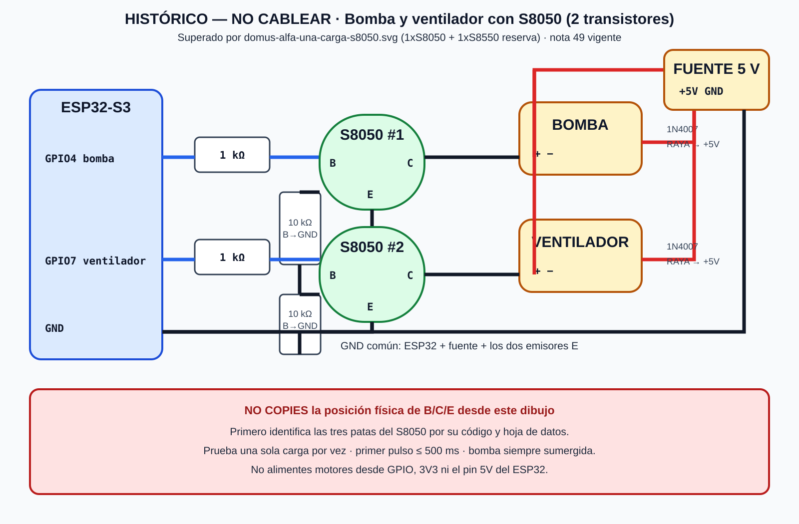

# Transistores para la bomba y el ventilador

> [!WARNING]
> **Documento superado:** se confirmó que solo hay un S8050 y un S8550. Usa
> [[49 - Prueba de una carga con un S8050 y TP4056]]. Este esquema de dos S8050
> se conserva únicamente como historial y no autoriza cableado.
> Actualización 2026-09-12 (ola 1, nota 50): el SVG `domus-alfa-motores-s8050.svg`
> lleva sello HISTÓRICO — NO CABLEAR; el firmware añade perfiles excluyentes
> `ALFA_BOMBA_1` / `ALFA_VENTILADOR_1`.

> [!DANGER]
> Este circuito todavía **no está autorizado para energizarse**. Primero hay que
> identificar físicamente las patas `E`, `B` y `C` de cada S8050, medir la fuente
> externa y probar **un solo motor a la vez**. Una conexión E/B/C equivocada puede
> dañar el transistor, el ESP32 o la carga.



## La idea básica

El GPIO no alimenta el motor. El GPIO solamente abre o cierra el transistor. La
bomba y el ventilador reciben energía de una **fuente externa regulada de 5 V**.

Cada motor necesita su propio conjunto:

- un transistor S8050;
- una resistencia de 1 kΩ entre GPIO y base;
- una resistencia de 10 kΩ entre base y GND para mantenerlo apagado al arrancar;
- un diodo 1N4007 en paralelo con el motor;
- cables de potencia y GND común.

## Qué significan B, C y E

| Letra | Nombre | Se conecta a |
|---|---|---|
| `B` | Base | GPIO a través de resistencia de 1 kΩ. |
| `C` | Colector | Terminal negativo del motor. |
| `E` | Emisor | GND común. |

> [!IMPORTANT]
> No podemos afirmar todavía “pata izquierda = E” o “pata derecha = C”. Aunque
> muchos S8050 TO-92 muestran `E-B-C` mirando la cara plana, existen variantes y
> fabricantes con orden diferente. Lee el código completo del cuerpo y consulta
> su hoja de datos; si no se distingue, compruébalo con multímetro antes de cablear.

## Circuito de la bomba — solamente durante `ALFA_MOTOR_1`

```text
ESP32 GPIO4 ── resistencia 1 kΩ ──┬── B del S8050 #1
                                  │
                              resistencia 10 kΩ
                                  │
GND común ────────────────────────┴── E del S8050 #1

Fuente externa +5 V ────────┬──── (+) BOMBA (−) ──── C del S8050 #1
                            │          │
                            └──|<|─────┘
                              1N4007
                       raya del diodo hacia +5 V

Fuente externa GND ─────────────── GND común ───────── ESP32 GND
```

El 1N4007 va en paralelo con la bomba: la pata con **raya plateada** queda del
lado positivo `+5 V`; la pata sin raya queda del lado del colector/motor negativo.

## Circuito del ventilador — solamente durante `ALFA_MOTOR_1`

```text
ESP32 GPIO7 ── resistencia 1 kΩ ──┬── B del S8050 #2
                                  │
                              resistencia 10 kΩ
                                  │
GND común ────────────────────────┴── E del S8050 #2

Fuente externa +5 V ────┬──── (+) VENTILADOR (−) ──── C del S8050 #2
                        │              │
                        └────|<|───────┘
                            1N4007
                     raya del diodo hacia +5 V

Fuente externa GND ─────────────── GND común ───────── ESP32 GND
```

## Qué es “GND común”

Hay que unir estas tres tierras:

```text
GND del ESP32 ── GND de la fuente externa ── emisores E de los S8050
```

Solo se unen los negativos. **No unas directamente el +5 V externo con 3V3 ni
con un GPIO.** El ESP32 permanece alimentado por USB durante el banco.

## Orden seguro de prueba

1. USB y fuente externa desconectados.
2. Identifica por hoja de datos las patas `E/B/C` del primer S8050.
3. Monta únicamente un LED de prueba o la bomba; no montes ambas cargas motrices.
4. Comprueba continuidad y que el diodo tenga la raya hacia `+5 V`.
5. Une los GND antes de aplicar la señal del GPIO.
6. Habilita solamente la bomba en el perfil de compilación; ventilador permanece bloqueado.
7. Primer pulso máximo: **500 ms**, con la bomba sumergida.
8. Desconecta y revisa si el transistor calentó o hubo reinicio.
9. Repite el proceso por separado para el ventilador.

## Señales para detenerse

- El S8050 se calienta al tocarlo después de un pulso corto.
- El ESP32 se reinicia o la pantalla se apaga.
- El motor gira débil, vibra o no arranca.
- La fuente cae por debajo de su tensión nominal.
- No se conoce el consumo de arranque.
- No se pudo confirmar E/B/C.

En cualquiera de esos casos se abandona la prueba con S8050 y se evalúa el L293D
o el controlador doble después de identificarlo. No se conectan transistores en
paralelo para “dar más corriente”.

## Estado actual del firmware

En `ALFA_UN_COSTADO_SIN_IR`, `GPIO4` y `GPIO7` existen en el mapa, pero las dos
salidas motrices están bloqueadas. Eso es intencional. No cambies ambas banderas
a `true`: el perfil de prueba debe permitir solo una carga por compilación.

Fuente técnica: [[46 - Plan maestro de consolidacion un costado]].
