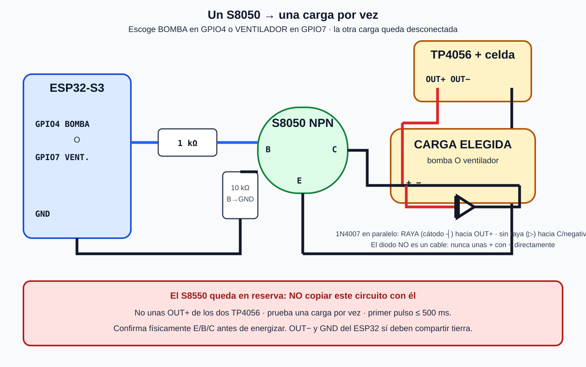

# Prueba de una carga con un S8050 y TP4056

Hecho observado: la minibomba y el ventilador funcionan en las pruebas. Para el
banco actual se utiliza **un solo S8050** y se conecta **una sola carga por vez**.

> [!NOTE] Actualización 2026-09-12 (ola 1, nota 50): el firmware implementa los
> perfiles excluyentes `ALFA_BOMBA_1` (solo GPIO4) y `ALFA_VENTILADOR_1`
> (solo GPIO7) con `static_assert` anti-doble-motor. S8550 sigue en reserva.



## Qué hacemos con cada transistor

| Pieza disponible | Uso actual |
|---|---|
| 1 × S8050, NPN | Interruptor de lado bajo para la carga que se esté probando. |
| 1 × S8550, PNP | Reserva. No conectarlo como sustituto directo del segundo S8050. |

El S8550 necesita un control de lado alto diferente. Conectarlo copiando el
esquema del S8050 invertiría terminales y comportamiento; además, apagarlo desde
una señal de 3.3 V puede requerir otra etapa. No se usa en esta ronda.

## Conexión única intercambiable

Selecciona **BOMBA** o **VENTILADOR**, nunca ambos:

```text
GPIO de prueba ── resistencia 1 kΩ ──┬── B del S8050
                                     │
                                 resistencia 10 kΩ
                                     │
GND común ───────────────────────────┴── E del S8050

TP4056 OUT+ ────────────┬──── (+) CARGA ELEGIDA (−) ─── C del S8050
                        │                 │
                        └──────|<|────────┘
                              1N4007
                     raya plateada hacia OUT+

TP4056 OUT− ───────────── GND común ───────────── ESP32 GND
```

GPIO elegido según la carga:

| Prueba | GPIO | Bandera de firmware | La otra carga |
|---|---:|---|---|
| Bomba | `GPIO4` | solo bomba habilitada | desconectada físicamente |
| Ventilador | `GPIO7` | solo ventilador habilitado | desconectada físicamente |

## Uso de los dos TP4056

Puedes reservar un módulo TP4056 para la bomba y otro para el ventilador, pero
en esta fase el S8050 se mueve al circuito que se vaya a probar. No unas `OUT+`
de los dos módulos entre sí y no pongas sus salidas en paralelo.

Antes de usar cada TP4056:

- confirma cuál terminal es `OUT+`, `OUT−`, `B+` y `B−`;
- conecta la celda únicamente a `B+` y `B−` con la polaridad correcta;
- usa `OUT+` y `OUT−` para la carga;
- no cargues la celda mientras haces la prueba del motor;
- no uses una celda hinchada, caliente o sin protección apropiada;
- para cambiar de bomba a ventilador, desconecta primero USB y batería.

## Diodo obligatorio

El 1N4007 queda en paralelo con la carga:

- pata con raya plateada → `OUT+`;
- pata sin raya → terminal negativo de la carga/colector `C`.

El diodo normalmente no conduce. Absorbe el golpe eléctrico que aparece al
apagar el motor.

## Orden de prueba

1. Desconecta el ESP32 y la batería del TP4056.
2. Confirma las patas `E`, `B` y `C` del S8050 por su código/hoja de datos.
3. Elige bomba o ventilador y deja la otra carga completamente desconectada.
4. Conecta resistencia de base, pull-down de 10 kΩ y 1N4007.
5. Une `OUT−` con GND del ESP32.
6. Revisa que `OUT+` nunca toque un GPIO ni 3V3.
7. Arranca con un pulso de 500 ms; la bomba debe estar sumergida.
8. Desconecta y revisa temperatura del S8050, cables, TP4056 y celda.
9. Para probar la otra carga, apaga todo y mueve el circuito completo.

## Lo que cambia en el firmware

El perfil normal mantiene ambos motores bloqueados. La prueba debe compilarse
como uno de estos perfiles mutuamente exclusivos:

```text
ALFA_BOMBA_1       -> GPIO4 habilitado; GPIO7 bloqueado
ALFA_VENTILADOR_1  -> GPIO7 habilitado; GPIO4 bloqueado
```

Nunca se habilitan ambos con el inventario actual.

Fuente técnica general: [[46 - Plan maestro de consolidacion un costado]].
